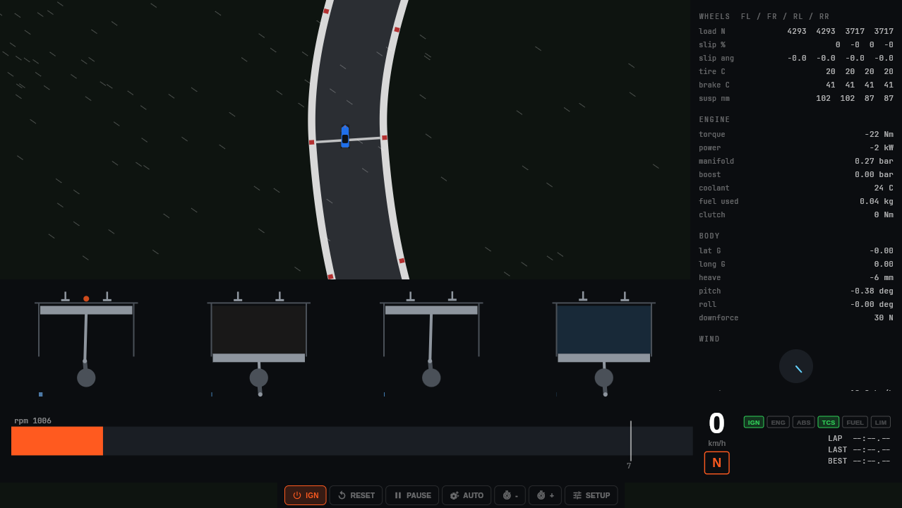

# carsim

A high-fidelity car simulator built with Flutter. Every major subsystem of the
car is modelled as a physical system rather than a lookup table:

- **Engine**: per-cylinder four-stroke cycle. Each piston is a slider-crank
  with its own compression, combustion (Wiebe heat release), expansion,
  exhaust and intake phases. Cylinder pressures sum into crankshaft torque
  through the crank geometry.
- **Drivetrain**: clutch slip, stepped gearbox, final drive and differential
  with per-wheel torque split.
- **Tires**: combined-slip tire model with load sensitivity, per-wheel slip
  ratio and slip angle, plus brake torque with ABS.
- **Suspension**: per-corner spring/damper with anti-roll bars driving live
  weight transfer.
- **Aerodynamics**: drag, downforce and side force from apparent wind, fed by
  a gusty wind field (filtered turbulence) that you can watch shove the car
  around.
- **Environment**: configurable ambient wind, turbulence intensity, air
  density and surface grip.

Runs on Android, iOS, Linux, macOS, Windows and web.



## Controls

| Key | Action |
|---|---|
| W / Up | throttle |
| S / Down | brake |
| A / D or arrows | steer |
| Space | handbrake |
| C | clutch |
| E / Q | shift up / down (manual) |
| I | ignition |
| M | auto / manual gearbox |
| R | reset car |
| P | pause |

Touch layouts get an on-screen steering pad and analog pedals.


## Install

| Platform | Package |
|---|---|
| Android | `carsim-android.apk` / `.aab` from [releases](https://gitlab.com/HttpAnimations/carsim/-/releases) |
| iOS | unsigned `.ipa` via the [AltStore source](https://httpanimations.gitlab.io/carsim/altstore/apps.json) |
| Linux | `.tar.gz`, `.zip`, `.deb`, `.rpm`, AppImage |
| Windows | `.zip` (x86_64, arm64) |
| macOS | `.dmg` / `.zip` (arm64) |
| Web | https://httpanimations.gitlab.io/carsim/ |

## Development

```bash
flutter pub get
flutter test
flutter run
```

Releases are automated: conventional commits on `main` are picked up by
cocogitto, which bumps the version, generates the changelog and tags a
release. GitHub Actions builds every target and binaries are synced back to
GitLab releases.

## License

[AGPL-3.0](LICENSE)
